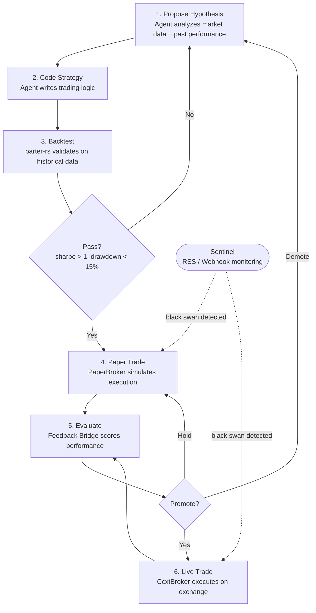

# rara-trading

A self-iterating closed-loop trading agent system built in Rust.

## How It Works

The system runs one continuous loop: **research proposes strategies, trading executes them, feedback improves them.**



The **Sentinel** runs in parallel — monitoring news feeds and on-chain data. If it detects a black swan event, it blocks trading immediately.

## Components

| Module | What it does |
|--------|-------------|
| **Research Engine** | Agent proposes hypotheses, codes strategies, backtests them |
| **Trading Engine** | Executes trades through guard pipeline → broker |
| **Sentinel** | Monitors market signals, blocks trading on black swans |
| **Feedback Bridge** | Evaluates live performance, decides promote/hold/demote |
| **Event Bus** | Persistent message bus connecting all components (sled) |

## Supported Markets

| Market | Broker | Status |
|--------|--------|--------|
| Crypto Spot | ccxt-rust (Binance, OKX, Bybit) | Implemented |
| Crypto Perpetual | ccxt-rust | Implemented |
| Stocks | Alpaca | Planned |
| Prediction Markets | Polymarket | Planned |

## Tech Stack

Rust (2024 edition), tokio, sled, barter-rs, ccxt-rust, snafu, jiff, rust_decimal

## Development

```bash
cargo run -- --help
cargo test
cargo clippy --all-targets --all-features -- -D warnings
```

## Status

See [Issue #1](https://github.com/rararulab/rara-trading/issues/1) for progress.

## License

MIT
