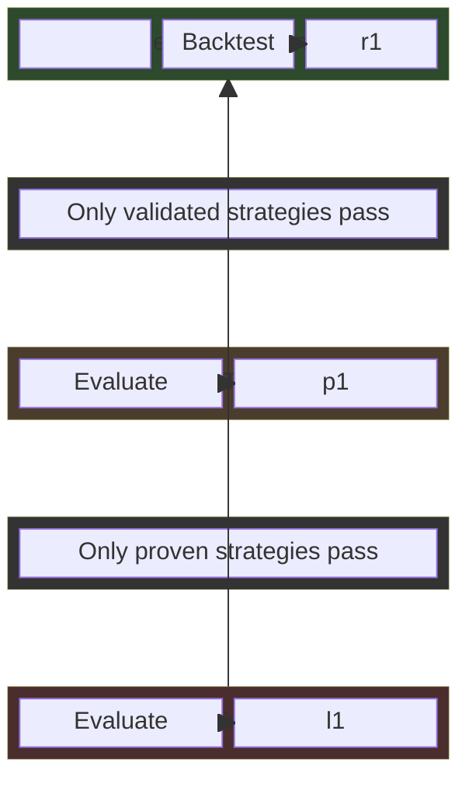
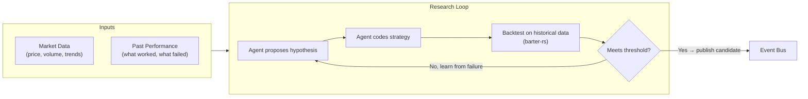
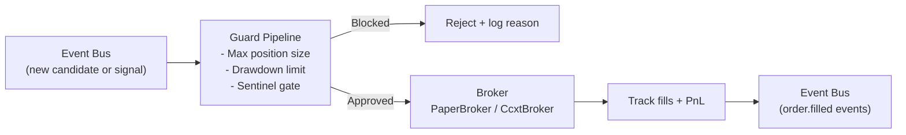
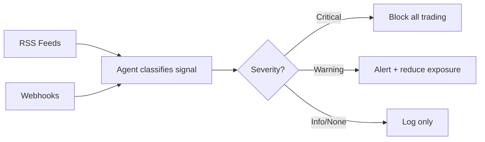
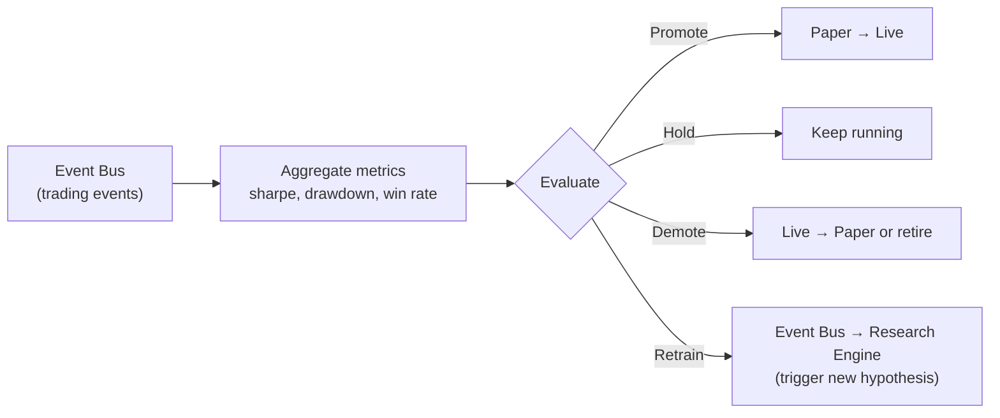

# rara-trading

A self-iterating closed-loop trading system built in Rust. Inspired by [RD-Agent](https://github.com/microsoft/RD-Agent), the system autonomously proposes strategy hypotheses, validates them through backtesting and paper trading, and promotes proven strategies to live execution.

## System Overview

The system consists of **independent components**, each running its own loop. Components are decoupled and communicate through an **event bus** (sled-backed persistent messaging).



### How Each Component Works

**Research Engine** — proposes and validates strategies autonomously



**Trading Engine** — executes with risk controls



**Sentinel** — monitors for black swan events (runs independently)



**Feedback Bridge** — closes the loop



## Architecture

### Client / Server

The system uses a **C/S architecture** with gRPC, allowing the TUI dashboard to connect locally or remotely.

```
rara run ──► rara-server (gRPC :50051)
                    │
                    ▼
           rara-tui (client)
           ratatui + crossterm
```

- `rara run` — starts the full daemon (research + paper trading + feedback + gRPC server)
- `rara serve` — starts the gRPC server standalone
- `rara tui` — connects to a running server for real-time monitoring

### WASM Strategy Pipeline

Strategies are compiled to **WebAssembly** (`wasm32-wasip1`) for sandboxed execution:

```
Hypothesis → LLM codes Rust → cargo build → .wasm artifact → wasmtime runtime
```

1. **Code generation** — LLM writes strategy code implementing `on_candles()`, `risk_levels()`, `meta()`
2. **Compilation** — `StrategyCompiler` builds against `strategies/template/` targeting `wasm32-wasip1`
3. **Backtesting** — `WasmExecutor` loads the WASM binary via wasmtime, runs against historical data
4. **Promotion** — accepted strategies saved to `~/.rara-trading/strategies/promoted/`
5. **Execution** — paper/live trading loads promoted WASM strategies at runtime

The **Strategy API** (`rara-strategy-api` crate) defines the contract:

| Export | Purpose |
|--------|---------|
| `wasm_meta()` | Returns `StrategyMeta` (name, version, api_version) |
| `wasm_on_candles()` | Processes `Vec<Candle>` → returns `Signal` (Entry/Exit/Hold) |
| `wasm_risk_levels()` | Computes stop-loss and take-profit for a position |

API versioning (`API_VERSION = 1`) ensures compatibility between the runtime and strategy artifacts.

### Strategy Registry

Pre-built strategies from [`rara-strategies`](https://github.com/rararulab/rara-strategies) can be fetched directly:

```bash
rara-trading strategy list              # List available strategies
rara-trading strategy fetch btc-momentum  # Download, validate, install
rara-trading strategy installed         # List locally installed
```

The registry downloads WASM artifacts from GitHub Releases, validates API version compatibility via `WasmExecutor`, and saves to the promoted strategies directory.

### Crate Layout

```
rara-trading (workspace root — CLI binary)
├── rara-domain         Core domain models (Hypothesis, Experiment, Contract, etc.)
├── rara-event-bus      Sled-backed persistent event bus
├── rara-research       Research loop, WASM compilation, backtesting, promotion
├── rara-strategy-api   Shared types for WASM strategy interface (Candle, Signal, etc.)
├── rara-market-data    TimescaleDB market data storage + Binance/Yahoo fetchers
├── rara-trading-engine Order execution, guard pipeline, broker abstraction
├── rara-feedback       Strategy evaluation and lifecycle management
├── rara-sentinel       External signal monitoring (RSS, webhooks)
├── rara-agent          LLM backend abstraction (Claude, Codex)
├── rara-infra          Shared infrastructure (config, logging, database)
├── rara-server         gRPC server (tonic) — SystemStatus + EventStream
└── rara-tui            Terminal dashboard (ratatui) — 4-tab cockpit view
```

## Key Design Principles

1. **Components are decoupled** — each runs independently, communicates via event bus polling
2. **Stage gates with clear thresholds** — strategies must earn their way from research → paper → live
3. **Agent-driven research** — hypotheses come from analyzing both market data AND past trading performance
4. **WASM sandbox** — strategies execute in wasmtime with fuel limits, preventing runaway computation
5. **No mocks** — all components are real implementations (ccxt-rust, barter-rs, RSS feeds)

## Supported Markets

| Market | Broker | Status |
|--------|--------|--------|
| Crypto Spot | ccxt-rust (Binance, OKX, Bybit) | Implemented |
| Crypto Perpetual | ccxt-rust | Implemented |
| Stocks | Alpaca | Planned |
| Prediction Markets | Polymarket | Planned |

## Tech Stack

Rust 2024, tokio, TimescaleDB, wasmtime, barter-rs, ccxt-rust, tonic/prost (gRPC), ratatui, snafu, jiff, rust_decimal

## Getting Started

### 1. Start Database

```bash
docker compose up -d timescaledb
```

This starts a TimescaleDB instance on `localhost:5432` (user: `rara`, password: `rara`, db: `rara_trading`). Migrations run automatically on first CLI use.

### 2. Fetch Market Data

```bash
# Fetch BTC/USDT 1m candles from Binance
rara-trading data fetch --source binance --symbol BTCUSDT --start 2026-01-01 --end 2026-03-25

# Fetch SPY daily candles from Yahoo Finance
rara-trading data fetch --source yahoo --symbol SPY --start 2025-01-01 --end 2025-12-31
```

Already-fetched days are skipped automatically — safe to re-run for incremental updates.

### 3. Check Data Coverage

```bash
rara-trading data info
```

Returns JSON with all stored instruments, their date ranges, and candle counts.

### 4. Run Research Loop

```bash
# Run 10 iterations of hypothesis → code → backtest
rara-trading research run --iterations 10 --contract BTC-USDT
```

### 5. Start Full System

```bash
# Start all components: research + paper trading + feedback + gRPC server
rara-trading run --contracts BTC-USDT --iterations 10 --grpc-addr 0.0.0.0:50051
```

### 6. Launch TUI Dashboard

```bash
# Connect to local server
rara-trading tui

# Connect to remote server
rara-trading tui --server http://192.168.1.100:50051
```

### 7. Fetch Pre-built Strategies

```bash
# List available from rara-strategies registry
rara-trading strategy list

# Download and validate
rara-trading strategy fetch btc-momentum
```

### 8. Query with DuckDB (optional)

```bash
duckdb -c "
LOAD postgres;
ATTACH 'dbname=rara_trading user=rara password=rara host=localhost port=5432' AS ts (TYPE POSTGRES);
SELECT * FROM ts.public.candles LIMIT 10;
"
```

## CLI Reference

| Command | Description |
|---------|-------------|
| `run [--contracts C] [--iterations N] [--grpc-addr ADDR]` | Run full loop (research + paper + feedback + gRPC) |
| `serve [--port PORT]` | Start gRPC server standalone |
| `tui [--server URL]` | Launch TUI dashboard |
| `data fetch --source <binance\|yahoo> --symbol SYM --start DATE --end DATE` | Fetch historical candles (idempotent) |
| `data info` | Show data coverage per instrument (JSON) |
| `research run [--iterations N] [--contract C] [--quiet]` | Run N research loop iterations |
| `research list [--limit N]` | List experiment history |
| `research show --experiment-id ID` | Show experiment details |
| `research promoted [--promoted-dir DIR]` | List promoted strategies |
| `strategy list [--repo REPO]` | List strategies from GitHub registry |
| `strategy fetch NAME [--repo REPO]` | Fetch, validate, and install a strategy |
| `strategy installed` | List locally installed registry strategies |
| `paper start [--contracts C]` | Start paper trading with promoted strategies |
| `paper status` | Show paper trading status |
| `paper stop` | Stop paper trading |
| `feedback report [--strategy ID] [--limit N]` | Show strategy evaluation history |
| `config init [--force]` | Generate config template |
| `config set KEY VALUE` / `config get KEY` / `config list` | Manage configuration |
| `validate` | Validate config and check connectivity |
| `agent PROMPT [--backend B]` | Run a prompt through the LLM backend |

All commands output structured JSON to stdout (human-readable logs go to stderr), making them suitable for agent/LLM consumption.

## TUI Dashboard

The TUI provides a real-time cockpit view with 4 tabs:

| Tab | Content |
|-----|---------|
| **Overview** | Strategies, positions, events, system status, alerts, research progress |
| **Research** | Hypothesis list, backtest results, progress gauge, SOTA tracker |
| **Trading** | Account summary, positions, order log, PnL sparkline |
| **Strategies** | Strategy lifecycle (promoted/active/demoted/retired), evaluation timeline |

Responsive layout: dual-column at ≥120 cols, single-column below. Rosé Pine color theme.

## Development

```bash
cargo run -- --help
cargo test
cargo clippy --all-targets --all-features -- -D warnings
```

## Status

See [Issue #1](https://github.com/rararulab/rara-trading/issues/1) for progress.

## License

MIT
