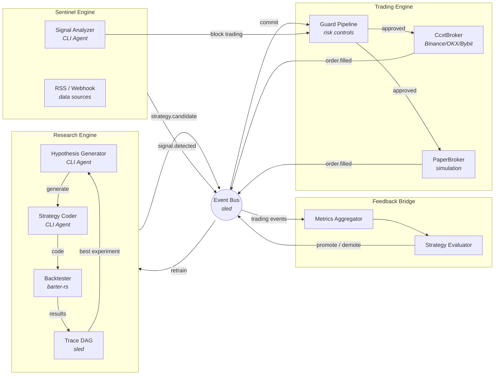
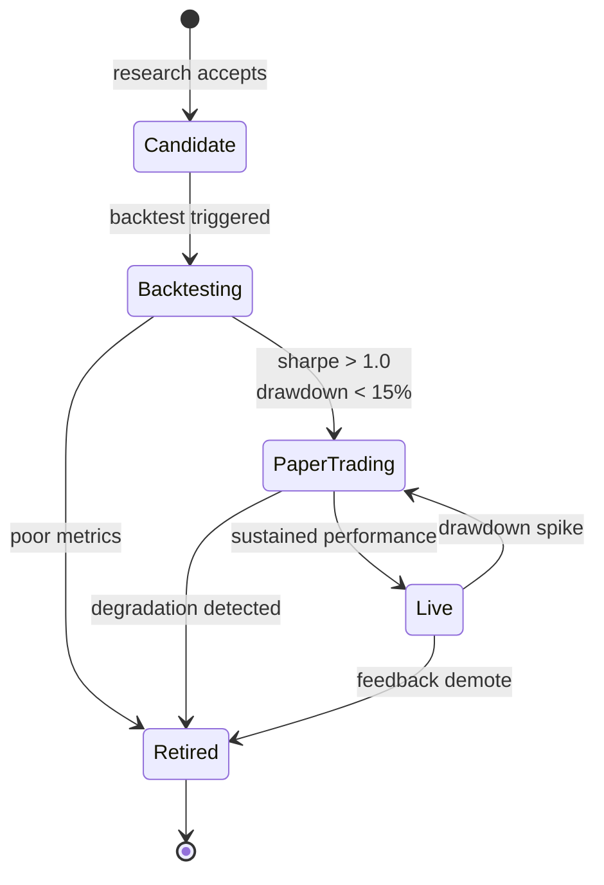
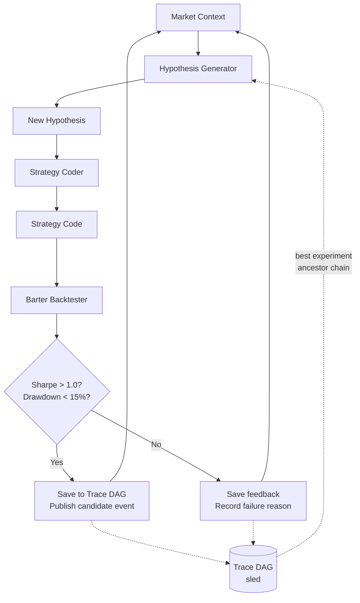
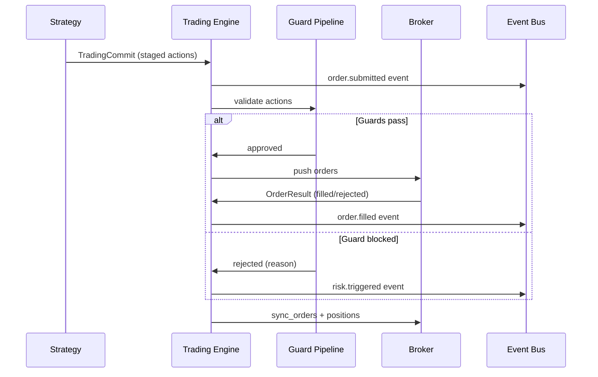

# rara-trading

A self-iterating closed-loop trading agent system built in Rust. The system autonomously generates strategy hypotheses, backtests them, executes trades, monitors market sentiment, and feeds performance data back into the research loop for continuous improvement.

## Architecture

### Closed Loop



### Strategy Lifecycle



### Research Loop Detail



### Trading Execution Flow



### Components

| Module | Description | Key Types |
|--------|-------------|-----------|
| **Research Engine** | RD-Agent style hypothesis → code → backtest → evaluate loop | `ResearchLoop`, `HypothesisGenerator`, `StrategyCoder`, `BarterBacktester`, `Trace` (DAG) |
| **Trading Engine** | OpenAlice style stage → commit → guard → push → sync execution | `TradingEngine`, `GuardPipeline`, `CcxtBroker`, `PaperBroker` |
| **Sentinel Engine** | Market surveillance for black swan detection | `SentinelEngine`, `SignalAnalyzer`, `RssDataSource`, `WebhookDataSource` |
| **Feedback Bridge** | Performance evaluation and strategy lifecycle management | `FeedbackBridge`, `MetricsAggregator`, `StrategyEvaluator` |
| **Event Bus** | sled-backed persistent event bus with broadcast notifications | `EventBus`, `EventStore` |
| **Domain Models** | Contract types, strategies, orders, signals | `Contract`, `SecType`, `Strategy`, `StagedAction`, `TradingCommit` |

### Supported Markets

- **Crypto Spot** — via ccxt-rust (Binance, OKX, Bybit)
- **Crypto Perpetual/Futures** — leveraged trading with funding rate awareness
- **Stocks** — planned (Alpaca integration)
- **Prediction Markets** — planned (Polymarket)

### Strategy Types

- Directional (trend following, mean reversion)
- Cross-exchange arbitrage
- Pairs trading
- Prediction market arbitrage
- Basis arbitrage (spot vs futures)

## Tech Stack

- **Language**: Rust (edition 2024)
- **Async runtime**: tokio
- **Persistence**: sled (event bus, trace DAG)
- **Backtesting**: barter-rs
- **Exchange connectivity**: ccxt-rust
- **Agent execution**: CLI executor (Claude, Kiro, Gemini, Codex, etc.)
- **Error handling**: snafu
- **Timestamps**: jiff
- **Financial math**: rust_decimal

## Local Development

```bash
# Build and run
cargo run -- --help

# Run tests
cargo test

# Lint
cargo clippy --all-targets --all-features -- -D warnings
```

## Project Status

See [Issue #1](https://github.com/rararulab/rara-trading/issues/1) for architecture design and progress tracking.

## License

MIT
