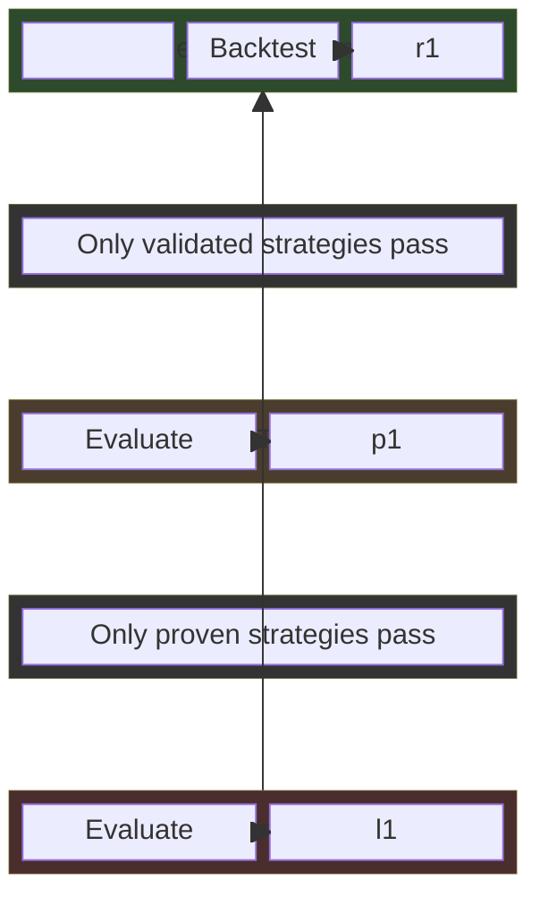
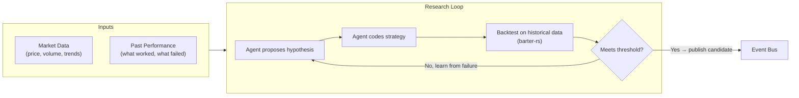
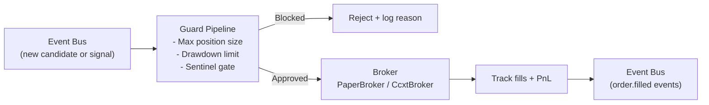
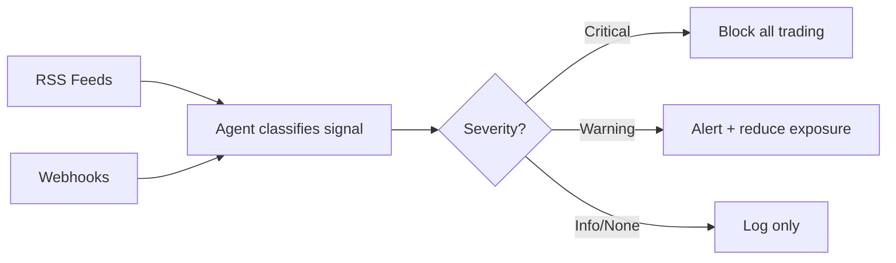
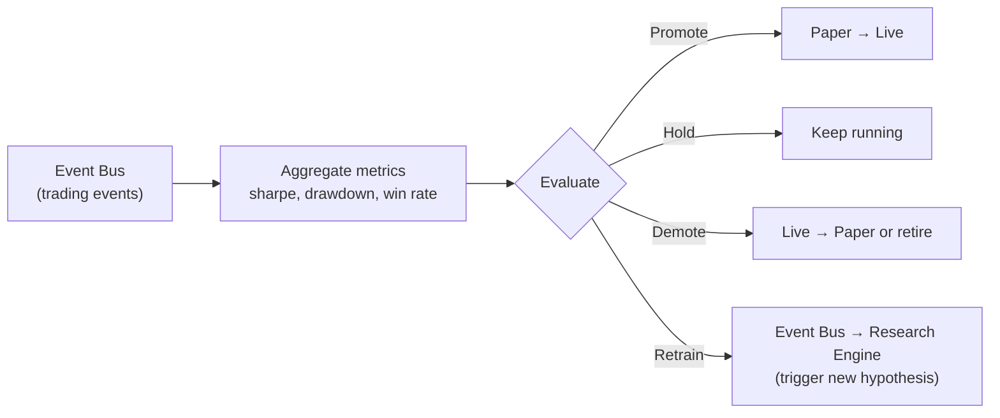

# rara-trading

A self-iterating closed-loop trading system built in Rust. Inspired by [RD-Agent](https://github.com/microsoft/RD-Agent), the system autonomously proposes strategy hypotheses, validates them through backtesting and paper trading, and promotes proven strategies to live execution.

## System Overview

The system consists of **independent components**, each running its own loop. Components are decoupled and communicate through an **event bus** (sled-backed persistent messaging).



### How Each Component Works

**Research Engine** — proposes and validates strategies autonomously



**Trading Engine** — executes with risk controls



**Sentinel** — monitors for black swan events (runs independently)



**Feedback Bridge** — closes the loop



## Key Design Principles

1. **Components are decoupled** — each runs independently, communicates via event bus polling
2. **Stage gates with clear thresholds** — strategies must earn their way from research → paper → live
3. **Agent-driven research** — hypotheses come from analyzing both market data AND past trading performance
4. **No mocks** — all components are real implementations (ccxt-rust, barter-rs, RSS feeds)

## Supported Markets

| Market | Broker | Status |
|--------|--------|--------|
| Crypto Spot | ccxt-rust (Binance, OKX, Bybit) | Implemented |
| Crypto Perpetual | ccxt-rust | Implemented |
| Stocks | Alpaca | Planned |
| Prediction Markets | Polymarket | Planned |

## Tech Stack

Rust 2024, tokio, sled, barter-rs, ccxt-rust, snafu, jiff, rust_decimal

## Development

```bash
cargo run -- --help
cargo test
cargo clippy --all-targets --all-features -- -D warnings
```

## Status

See [Issue #1](https://github.com/rararulab/rara-trading/issues/1) for progress.

## License

MIT
